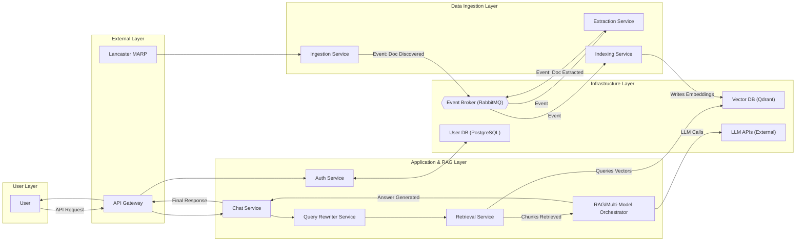

[](https://codecov.io/gh/DominykasPivo/MARP-Guide-RAG-Chatbot)

# MARP-Guide-RAG-Chatbot
LZSCC.311  - Year 3 Group Project

RAG Chatbot with Microservices and Event-Driven Architecture

## 🚀 Quick Start

## **Setup and Run Instructions**

### **Prerequisites**

1. **Docker**: Install Docker (20.10+) and Docker Compose (or Docker Desktop) on your system.
2. **Git**: Clone this repository.
3. **API Keys**: Obtain an OpenRouter API key for LLM access (or configure an alternative LLM provider).

---

1. **Clone the repository**:
   ```bash
   git clone https://github.com/DominykasPivo/MARP-Guide-RAG-Chatbot.git
   cd MARP-Guide-RAG-Chatbot
   ```

2. **Set up environment variables**:
   ```bash
   # Linux/Mac
   cp .env.example .env

   # Windows PowerShell
   Copy-Item .env.example .env
   ```
   - Edit the `.env` file to configure API keys, database credentials, and other settings.
   - Add your OpenRouter API key:
     ```env
     OPENROUTER_API_KEY=your-api-key-here
     ```

3. **Start all services**:
   ```bash
   docker-compose up --build -d
   ```

4. **Access the application**:
   - **Frontend**: [http://localhost:8005](http://localhost:8005)
   - **Ingestion API**: [http://localhost:8001](http://localhost:8001)
   - **RabbitMQ Management**: [http://localhost:15672](http://localhost:15672) (default credentials: `guest/guest`)

5. **Verify service health**:
   - **Auth Service**: [http://localhost:8001/health](http://localhost:8001/health)
   - **Chat Service**: [http://localhost:8005/health](http://localhost:8005/health)

---

### **Development Setup**

For local development without Docker:

1. **Install Python 3.10-3.12**:
   - Ensure Python is installed and added to your PATH.

2. **Install dependencies**:
   ```bash
   pip install -r services/chat/requirements.txt
   pip install -r services/ingestion/requirements.txt
   pip install -r services/auth/requirements.txt
   # Repeat for other services as needed
   ```

3. **Start infrastructure**:
   ```bash
   docker-compose up rabbitmq qdrant
   ```

4. **Run services individually**:
   ```bash
   # Example: Running the Chat Service
   cd services/chat
   python -m app.app
   ```

5. **Verify service health**:
   - Check the `/health` endpoint for each service to ensure it is running.

---

📖 **For detailed configuration options, see:** [docs/ENV_SETUP_GUIDE.md](docs/ENV_SETUP_GUIDE.md)

# **Goal of Project | Chat AI Application**

Building a chat application that answers questions about Lancaster University’s Manual of Academic Regulations and Procedures (MARP). The answers must be derived from the processed MARP PDF documents and must be properly cited
(with title, page number, and link), and presented in an understandable manner.


## **1\. Key Features**

* **Document Ingestion Pipeline:** Event-driven workflow for processing MARP PDF documents and updating the knowledge base
* **Vector-Powered RAG:** Uses Qdrant vector database for semantic search and retrieval-augmented generation
* **Multi-LLM Support:** Compare answers from multiple free LLM models (Google Gemma, Meta Llama, Microsoft Phi) via OpenRouter
* **Configurable Architecture:** Comprehensive environment-based configuration for all services
* **Microservices Design:** Independent services communicating via RabbitMQ events
* **Semantic Chunking:** Intelligent document splitting using tiktoken for optimal context size
* **Production Ready:** Comprehensive CI/CD pipeline with testing, linting, and Docker builds

## **2\. Technology Stack**

| Component | Technology | Purpose |
| :---- | :---- | :---- |
| **Backend** | **Python (FastAPI)** | High-performance async API framework for all microservices (Replaced Flask) |
| **Event Broker** | **RabbitMQ** | Asynchronous message queue for event-driven architecture |
| **Vector Database** | **Qdrant** | Efficient vector similarity search for semantic retrieval (Replaced chromaDB) |
| **Embeddings** | **Sentence Transformers** | Pre-trained models for converting text to vector embeddings |
| **LLM Integration** | **OpenRouter** | Access to multiple free and paid language models |
| **Tokenization** | **Tiktoken** | OpenAI's tokenizer for accurate token counting and chunking |
| **Document Processing** | **PyPDF** | PDF text extraction and metadata parsing |
| **Orchestration** | **Docker Compose** | Container orchestration for multi-service deployment |
| **CI/CD** | **GitHub Actions** | Automated testing, linting, security scanning, and Docker builds |


## **3\. High Level Architecture Overview**





## **🧱 4\. Component Breakdown and Responsibilities**


| Component | Function / Role |
| :---- | :---- |
| **Ingestion Service** | Discovers new documents (e.g., MARP PDFs) and initiates the ingestion pipeline by publishing an event. |
| **Extraction Service** | Consumes the discovery event, extracts text and metadata from documents using tools like pdfplumber, and publishes the extracted data. |
| **Indexing Service** | Consumes extracted data, chunks documents semantically, generates vector embeddings, and persists data to the databases. |
| **Retrieval Service** | Handles the semantic search functionality for the RAG flow, querying Qdrant to retrieve relevant document chunks. |
| **Chat Service** | Serves as the central coordinator for the RAG query flow (FastAPI), managing the sequence of calls and formatting the final answer. |
| **Orchestrator** | Executes the Multi-Model Comparison feature by sending RAG context to multiple external LLM APIs concurrently. |
| **Auth Service** | Manages user authentication and authorization using data from PostgreSQL. |
| **API Gateway** | The single point of entry; routes external HTTP/S requests to the correct internal microservice. |
| **Qdrant** | The high-performance Vector Database for storing and indexing document embeddings for semantic search. |
| **RabbitMQ** | The Event Broker used to implement the Asynchronous Event-Driven Architecture for the document ingestion pipeline. |
| **PostgreSQL** | The relational User Database used for user data, authentication details, and document ingestion metadata. |
| **LLM APIs** (External) | Third-party interfaces for Large Language Models accessed by the Orchestrator for content generation. |


### **Document Ingestion Pipeline (Event-Driven)**

1. **Discovery:** Ingestion service discovers new PDF documents
2. **Extraction:** Extraction service extracts text content from PDFs
3. **Chunking:** Indexing service splits text into semantic chunks using tiktoken
4. **Embedding:** Chunks are converted to vector embeddings using Sentence Transformers
5. **Storage:** Embeddings stored in Qdrant vector database for fast similarity search

### **RAG Query Flow**

1. **User Query:** User submits a question via chat interface
2. **Retrieval:** Query is embedded and similar chunks retrieved from Qdrant
3. **Context Building:** Retrieved chunks form the context for the LLM
4. **Generation:** Multiple LLMs generate answers using the context
5. **Response:** Answers presented with citations (title, page, URL)


## **5\. Setup and Run Instructions**

### **Prerequisites**

1. **Docker**: Install Docker (20.10+) and Docker Compose (or Docker Desktop) on your system.
2. **Git**: Clone this repository.
3. **API Keys**: Obtain an OpenRouter API key for LLM access (or configure an alternative LLM provider).

---

### **Quick Start**

1. **Clone the repository**:
   ```bash
   git clone https://github.com/DominykasPivo/MARP-Guide-RAG-Chatbot.git
   cd MARP-Guide-RAG-Chatbot
   ```

2. **Set up environment variables**:
   ```bash
   # Linux/Mac
   cp .env.example .env

   # Windows PowerShell
   Copy-Item .env.example .env
   ```
   - Edit the `.env` file to configure API keys, database credentials, and other settings.

3. **Start all services**:
   ```bash
   docker-compose up --build -d
   ```

4. **Access the application**:
   - **Frontend**: [http://localhost:8004](http://localhost:8004)
   - **RabbitMQ Management**: [http://localhost:15672](http://localhost:15672) (default credentials: `guest/guest`)

5. **Verify service health**:
   - **Auth Service**: [http://localhost:8001/health](http://localhost:8001/health)
   - **Chat Service**: [http://localhost:8005/health](http://localhost:8005/health)

---

### **Development Setup**

For local development without Docker:

1. **Install Python 3.10-3.12**:
   - Ensure Python is installed and added to your PATH.

2. **Install dependencies**:
   ```bash
   pip install -r services/chat/requirements.txt
   pip install -r services/ingestion/requirements.txt
   pip install -r services/auth/requirements.txt
   # Repeat for other services as needed
   ```

3. **Start infrastructure**:
   ```bash
   docker-compose up rabbitmq qdrant
   ```

4. **Run services individually**:
   ```bash
   # Example: Running the Chat Service
   cd services/chat
   python -m app.app
   ```

5. **Verify service health**:
   - Check the `/health` endpoint for each service to ensure it is running.

---


## **6\. Testing & Quality Assurance**

[](https://github.com/DomasB123/MARP-Guide-RAG-Chatbot/actions/workflows/ci.yml)
[](https://codecov.io/gh/DomasB123/MARP-Guide-RAG-Chatbot)

### **Test Suite**

The project includes comprehensive test coverage with **100+ test cases**:

- **Unit Tests** (`tests/unit/`): Test individual components in isolation
  - **Chat Service:** Event handling, citation formatting, context building
  - **Retrieval Service:** Vector search, RabbitMQ integration, error handling
  - **Ingestion Service:** Document discovery, storage operations, thread safety
  - **Indexing Service:** Semantic chunking, event processing
  - **Event System:** Event creation, correlation IDs, metadata preservation

- **Integration Tests** (`tests/integration/`): Test service interactions
  - End-to-end ingestion flow with document processing
  - Indexing pipeline with vector database operations
  - Search API with real queries
  - Event-driven communication patterns
  - Concurrent access and error scenarios

**Note:** The Extraction Service currently has limited test coverage and is a candidate for future test expansion.

### **Running Tests Locally**

**Install each service's requirements:**
```bash
pip install -r services/chat/requirements.txt
pip install -r services/ingestion/requirements.txt
pip install -r services/extraction/requirements.txt
pip install -r services/indexing/requirements.txt
pip install -r services/retrieval/requirements.txt
```

**Then install requirements for testing:**
```bash
#If your file is in the project root use:
pip install -r tests/requirements-test.txt
```

**Run all tests:**
```bash
pytest tests

# Run with verbose output
pytest -v
```

**To ensure you use the correct Python environment, run tests with:**
```bash
# (Recommended) Create and activate a virtual environment
python -m venv .venv
source .venv/bin/activate      # On Linux/Mac
.\.venv\Scripts\activate       # On Windows

# Run tests using the current environment
python -m pytest tests
```

**Run all tests with coverage:**
```bash
pytest --cov=services --cov-report=term

# For a detailed HTML report:
python -m pytest --cov=services --cov-report=html
```

**Run specific test categories:**
```bash
# Unit tests only
pytest tests/unit/

# Integration tests only
pytest tests/integration/

# Specific service tests
pytest tests/unit/test_chat_service.py
```

**For detailed testing documentation, see [`tests/TEST_INFO.md`](tests/TEST_INFO.md)**
**TEST_INFO.md includes:**
- Test setup instructions (requirements, environment)
- How to run unit and integration tests
- Coverage reporting and viewing
- Troubleshooting tips for common issues
- Testing strategy and coverage notes

### **CI/CD Pipeline**

The project uses GitHub Actions for continuous integration: Every push and pull request
triggers the pipeline, which ensures code quality and deployment readiness.

## **CI/CD Pipeline Details**

This project uses a robust CI/CD pipeline powered by GitHub Actions to ensure code quality, reliability, and fast feedback for every change:

- **Automated Testing:** All pull requests and pushes to main trigger the full test suite (unit and integration) across Python 3.10–3.12. Coverage is reported to Codecov for visibility.
- **Linting & Security:** Code is checked with flake8 and security scanning tools to enforce best practices and catch vulnerabilities early.
- **Docker Builds:** Each microservice is built as a Docker image to validate containerization and enable seamless deployment.
- **Multi-Service Orchestration:** Docker Compose is used to spin up the full stack for integration tests, ensuring services work together as expected.
- **Quality Gates:** Builds fail if tests, linting, or security checks do not pass, preventing regressions from reaching production.
- **Artifacts & Caching:** Build artifacts and Docker layers are cached to speed up subsequent runs.
- **Extensible Workflow:** The pipeline is easily extendable for deployment to cloud platforms or additional quality checks.

**Pipeline File:** See [`.github/workflows/ci.yml`](.github/workflows/ci.yml) for the full workflow definition and customization options.
**Best Practices:**
- Keep tests and linting up to date with code changes.
- Use feature branches and pull requests to trigger the pipeline before merging.
- Review Codecov and CI status checks for every PR.

For more details, see [`docs/CI_TOOLS.md`](docs/CI_TOOLS.md), which includes:
- Overview of the CI/CD pipeline structure and workflow
- Step-by-step explanation of each stage (test, lint, build, security scan, Docker build, deploy)
- Environment variables and secrets used in the pipeline
- How to customize or extend the workflow for your needs
- Troubleshooting tips for common CI/CD issues
- Best practices for maintaining CI/CD quality gates

---

## **7\. Configuration**

### **Environment Variables**

The application uses a `.env` file for configuration. Copy the example file to get started (in the project root):

```bash
# Linux/Mac
cp .env.example .env

# Windows PowerShell
Copy-Item .env.example .env
```

**Add your OpenRouter API key:**
Edit `.env` and set:
```
OPENROUTER_API_KEY=your_key_here
```

### **Key Configuration Areas**

- **RabbitMQ:** Connection settings, retry configuration
- **Qdrant:** Vector database connection and collection settings
- **Embeddings:** Model selection, batch size
- **Chunking:** Token limits, encoding selection
- **LLM:** Model selection, API keys, generation parameters
- **Services:** Port mappings, timeouts, logging levels

### **Documentation**

- **Quick Start:** See `docs/QUICK_CONFIG.md` for common configurations
- **CI/CD Setup:** See `docs/CI_TOOLS.md` for pipeline configuration

---

## **8\. Deployment & Ports**

All services communicate via RabbitMQ events and REST APIs. The Chat service serves the frontend on port 8005.

| Service | Host Port | Access |
| :---- | :---- | :---- |
| Chat (Frontend) | 8005 | **Public:** Web UI at http://localhost:8005 |
| Ingestion | 8001 | **Internal:** Document upload endpoint |
| Extraction | 8002 | **Internal:** Event consumer |
| Indexing | 8003 | **Internal:** Event consumer |
| Retrieval | 8004 | **Internal:** Vector search API |
| RabbitMQ | 5672 | **Internal:** Message broker |
| RabbitMQ Management | 15672 | **Public:** Admin UI at http://localhost:15672 |
| Qdrant | 6333 | **Internal:** Vector database (Replaced ChromaDB) |
| Auth | 8006 | **Internal:** Authentication Broker |
---


## **8\. Architecture**

### **Event-Driven Microservices**

The system uses an event-driven architecture with RabbitMQ for asynchronous communication:

1. **Ingestion Service:** Discovers and uploads PDF documents
2. **Extraction Service:** Extracts text content from PDFs
3. **Indexing Service:** Chunks text, generates embeddings, stores in Qdrant
4. **Retrieval Service:** Performs semantic search in vector database
5. **Chat Service:** Orchestrates RAG flow and serves frontend

### **Key Technologies**

- **FastAPI 0.110.2:** High-performance async web framework
- **RabbitMQ:** Message broker for event-driven communication
- **Qdrant 1.8.2:** Vector database for similarity search
- **Sentence Transformers ≥3.1.0:** Text embedding generation
- **Tiktoken 0.12.0:** Token counting and text chunking
- **OpenRouter API:** Multi-LLM access for answer generation

### **Documentation**

For detailed architecture documentation, see:
- `docs/detailed_architecture.md` - Complete system design
- `docs/services/` - Individual service documentation
- `docs/events/` - Event flow diagrams and specifications

---

## **9\. Contributers**

- **DominykasPivo**
- **S3eedkabak**
- **AtillaBenligil**

---

## **10\. License**

This project is licensed under the MIT License - see the LICENSE file for details.

---

## **11\. Acknowledgments**

- **MARP Guide:** Source material for the RAG knowledge base
- **OpenRouter:** Multi-LLM API access
- **Qdrant:** High-performance vector database
- **Sentence Transformers:** State-of-the-art embedding models |


=======

